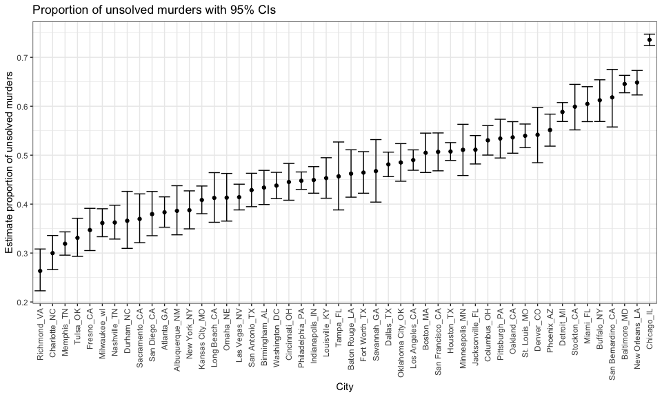
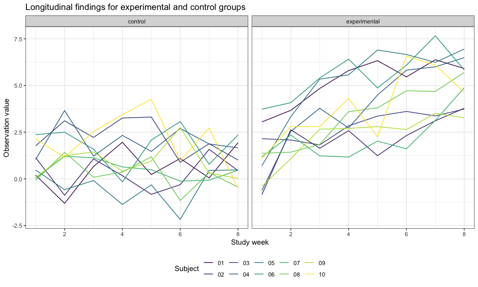

Homework 5
================
E. Brennan Bollman
20-11-18

``` r
library(tidyverse)
```

    ## ── Attaching packages ─────────────────────────────────────────────────────────── tidyverse 1.3.0 ──

    ## ✓ ggplot2 3.3.2     ✓ purrr   0.3.4
    ## ✓ tibble  3.0.3     ✓ dplyr   1.0.2
    ## ✓ tidyr   1.1.2     ✓ stringr 1.4.0
    ## ✓ readr   1.3.1     ✓ forcats 0.5.0

    ## ── Conflicts ────────────────────────────────────────────────────────────── tidyverse_conflicts() ──
    ## x dplyr::filter() masks stats::filter()
    ## x dplyr::lag()    masks stats::lag()

``` r
library(rvest)
```

    ## Loading required package: xml2

    ## 
    ## Attaching package: 'rvest'

    ## The following object is masked from 'package:purrr':
    ## 
    ##     pluck

    ## The following object is masked from 'package:readr':
    ## 
    ##     guess_encoding

``` r
knitr::opts_chunk$set(
  fig.width = 10,
  fig.asp = 0.6,
  out.width = "90%"
)

theme_set(theme_bw() + theme(legend.position = "bottom")) 

options(
  ggplot2.continuous.colour = "viridis",
  ggplot2.continuous.fill = "viridis"
)

scale_colour_discrete = scale_colour_viridis_d()
scale_fill_discrete = scale_fill_viridis_d()
```

## Problem 1

#### Step 1: Read in, describe, and prepare data

``` r
homicide_df = 
  read_csv("data/homicide-data.csv") %>% 
  mutate(
    city_state = str_c(city, state, sep = "_"),
    resolved = case_when(
      disposition == "Closed without arrest" ~ "unsolved",
      disposition == "Open/No arrest" ~ "unsolved",
      disposition == "Closed by arrest" ~ "solved"
    )
  ) %>% 
  select(city_state, resolved) %>% 
  filter(city_state != "Tulsa_AL")
```

    ## Parsed with column specification:
    ## cols(
    ##   uid = col_character(),
    ##   reported_date = col_double(),
    ##   victim_last = col_character(),
    ##   victim_first = col_character(),
    ##   victim_race = col_character(),
    ##   victim_age = col_character(),
    ##   victim_sex = col_character(),
    ##   city = col_character(),
    ##   state = col_character(),
    ##   lat = col_double(),
    ##   lon = col_double(),
    ##   disposition = col_character()
    ## )

This Washington Post dataset includes information on homicides between
the years 2007 and 2017 in major U.S. city: recording the name, age, and
race of the victim as well as geocoordinates for where the homicide took
place. Each case is categorized by whether an arrest was made, and
whether the case was closed: exploring patterns of unsolved homicides in
urban areas nationally.

#### Step 2: Compute total and unsolved homicides

For each city, want to count number of unsolved homicides, and then
number of total homicides so can compute proportion unsolved.

``` r
aggregate_df = 
  homicide_df %>% 
  group_by(city_state) %>% 
  summarize(
    hom_total = n(),
    hom_unsolved = sum(resolved == "unsolved")
  )
```

    ## `summarise()` ungrouping output (override with `.groups` argument)

#### Step 3: Trial prop test for single city

``` r
prop.test(
  aggregate_df %>% filter(city_state == "Baltimore_MD") %>% pull(hom_unsolved),
  aggregate_df %>% filter(city_state == "Baltimore_MD") %>% pull(hom_total)) %>% 
  broom::tidy()
```

    ## # A tibble: 1 x 8
    ##   estimate statistic  p.value parameter conf.low conf.high method    alternative
    ##      <dbl>     <dbl>    <dbl>     <int>    <dbl>     <dbl> <chr>     <chr>      
    ## 1    0.646      239. 6.46e-54         1    0.628     0.663 1-sample… two.sided

#### Step 4: Iterate prop test

``` r
results_df = 
  aggregate_df %>% 
  mutate(
    prop_tests = map2(.x = hom_unsolved, .y = hom_total, ~prop.test(x = .x, n = .y)),
    tidy_tests = map(.x = prop_tests, ~broom::tidy(.x))
  ) %>% 
  select(-prop_tests) %>% 
  unnest(tidy_tests) %>% 
  select(city_state, estimate, conf.low, conf.high) %>% 
  arrange(desc(estimate))
```

#### Step 5: Make a plot

``` r
results_df %>% 
  mutate(city_state = fct_reorder(city_state, estimate)) %>% 
  ggplot(aes(x = city_state, y = estimate)) + 
  geom_point() + 
  geom_errorbar(aes(ymin = conf.low, ymax = conf.high)) + 
  theme(axis.text.x = element_text(angle = 90, vjust = 0.5, hjust=1)) + 
  labs(
    title = "Proportion of unsolved murders with 95% CIs",
    x = "City",
    y = "Estimate proportion of unsolved murders"
  )
```



The cities with the highest proportion of unsolved homicides are
Chicago, New Orleans, and Baltimore. Having worked for 4 years as an
emergency physician in the only trauma center hospital serving New
Orleans, this finding unfortunately does not surprise me…

## Problem 2

#### Step 1: Read in data using map and tidy

``` r
study_df = 
  tibble(
    path = list.files("lda_data")
  ) %>% 
  mutate(path = str_c("lda_data/", path),
         lda_df = map(.x = path, read_csv)) %>% 
  unnest(lda_df) %>% 
  mutate(path = str_sub(path, start = 10L, end = 15L)) %>% 
  separate(
    path,
    into = c("study_arm", "subject"),
  ) %>% 
  mutate(
    study_arm = case_when(
      study_arm == "con" ~ "control",
      study_arm == "exp" ~ "experimental"
    )
  ) %>% 
  pivot_longer(
    week_1:week_8,
    names_to = "week",
    values_to = "observation"
  ) %>% 
  mutate(week = as.numeric(str_sub(week, start = 6L)))
```

    ## Parsed with column specification:
    ## cols(
    ##   week_1 = col_double(),
    ##   week_2 = col_double(),
    ##   week_3 = col_double(),
    ##   week_4 = col_double(),
    ##   week_5 = col_double(),
    ##   week_6 = col_double(),
    ##   week_7 = col_double(),
    ##   week_8 = col_double()
    ## )
    ## Parsed with column specification:
    ## cols(
    ##   week_1 = col_double(),
    ##   week_2 = col_double(),
    ##   week_3 = col_double(),
    ##   week_4 = col_double(),
    ##   week_5 = col_double(),
    ##   week_6 = col_double(),
    ##   week_7 = col_double(),
    ##   week_8 = col_double()
    ## )
    ## Parsed with column specification:
    ## cols(
    ##   week_1 = col_double(),
    ##   week_2 = col_double(),
    ##   week_3 = col_double(),
    ##   week_4 = col_double(),
    ##   week_5 = col_double(),
    ##   week_6 = col_double(),
    ##   week_7 = col_double(),
    ##   week_8 = col_double()
    ## )
    ## Parsed with column specification:
    ## cols(
    ##   week_1 = col_double(),
    ##   week_2 = col_double(),
    ##   week_3 = col_double(),
    ##   week_4 = col_double(),
    ##   week_5 = col_double(),
    ##   week_6 = col_double(),
    ##   week_7 = col_double(),
    ##   week_8 = col_double()
    ## )
    ## Parsed with column specification:
    ## cols(
    ##   week_1 = col_double(),
    ##   week_2 = col_double(),
    ##   week_3 = col_double(),
    ##   week_4 = col_double(),
    ##   week_5 = col_double(),
    ##   week_6 = col_double(),
    ##   week_7 = col_double(),
    ##   week_8 = col_double()
    ## )
    ## Parsed with column specification:
    ## cols(
    ##   week_1 = col_double(),
    ##   week_2 = col_double(),
    ##   week_3 = col_double(),
    ##   week_4 = col_double(),
    ##   week_5 = col_double(),
    ##   week_6 = col_double(),
    ##   week_7 = col_double(),
    ##   week_8 = col_double()
    ## )
    ## Parsed with column specification:
    ## cols(
    ##   week_1 = col_double(),
    ##   week_2 = col_double(),
    ##   week_3 = col_double(),
    ##   week_4 = col_double(),
    ##   week_5 = col_double(),
    ##   week_6 = col_double(),
    ##   week_7 = col_double(),
    ##   week_8 = col_double()
    ## )
    ## Parsed with column specification:
    ## cols(
    ##   week_1 = col_double(),
    ##   week_2 = col_double(),
    ##   week_3 = col_double(),
    ##   week_4 = col_double(),
    ##   week_5 = col_double(),
    ##   week_6 = col_double(),
    ##   week_7 = col_double(),
    ##   week_8 = col_double()
    ## )
    ## Parsed with column specification:
    ## cols(
    ##   week_1 = col_double(),
    ##   week_2 = col_double(),
    ##   week_3 = col_double(),
    ##   week_4 = col_double(),
    ##   week_5 = col_double(),
    ##   week_6 = col_double(),
    ##   week_7 = col_double(),
    ##   week_8 = col_double()
    ## )
    ## Parsed with column specification:
    ## cols(
    ##   week_1 = col_double(),
    ##   week_2 = col_double(),
    ##   week_3 = col_double(),
    ##   week_4 = col_double(),
    ##   week_5 = col_double(),
    ##   week_6 = col_double(),
    ##   week_7 = col_double(),
    ##   week_8 = col_double()
    ## )
    ## Parsed with column specification:
    ## cols(
    ##   week_1 = col_double(),
    ##   week_2 = col_double(),
    ##   week_3 = col_double(),
    ##   week_4 = col_double(),
    ##   week_5 = col_double(),
    ##   week_6 = col_double(),
    ##   week_7 = col_double(),
    ##   week_8 = col_double()
    ## )
    ## Parsed with column specification:
    ## cols(
    ##   week_1 = col_double(),
    ##   week_2 = col_double(),
    ##   week_3 = col_double(),
    ##   week_4 = col_double(),
    ##   week_5 = col_double(),
    ##   week_6 = col_double(),
    ##   week_7 = col_double(),
    ##   week_8 = col_double()
    ## )
    ## Parsed with column specification:
    ## cols(
    ##   week_1 = col_double(),
    ##   week_2 = col_double(),
    ##   week_3 = col_double(),
    ##   week_4 = col_double(),
    ##   week_5 = col_double(),
    ##   week_6 = col_double(),
    ##   week_7 = col_double(),
    ##   week_8 = col_double()
    ## )
    ## Parsed with column specification:
    ## cols(
    ##   week_1 = col_double(),
    ##   week_2 = col_double(),
    ##   week_3 = col_double(),
    ##   week_4 = col_double(),
    ##   week_5 = col_double(),
    ##   week_6 = col_double(),
    ##   week_7 = col_double(),
    ##   week_8 = col_double()
    ## )
    ## Parsed with column specification:
    ## cols(
    ##   week_1 = col_double(),
    ##   week_2 = col_double(),
    ##   week_3 = col_double(),
    ##   week_4 = col_double(),
    ##   week_5 = col_double(),
    ##   week_6 = col_double(),
    ##   week_7 = col_double(),
    ##   week_8 = col_double()
    ## )
    ## Parsed with column specification:
    ## cols(
    ##   week_1 = col_double(),
    ##   week_2 = col_double(),
    ##   week_3 = col_double(),
    ##   week_4 = col_double(),
    ##   week_5 = col_double(),
    ##   week_6 = col_double(),
    ##   week_7 = col_double(),
    ##   week_8 = col_double()
    ## )
    ## Parsed with column specification:
    ## cols(
    ##   week_1 = col_double(),
    ##   week_2 = col_double(),
    ##   week_3 = col_double(),
    ##   week_4 = col_double(),
    ##   week_5 = col_double(),
    ##   week_6 = col_double(),
    ##   week_7 = col_double(),
    ##   week_8 = col_double()
    ## )
    ## Parsed with column specification:
    ## cols(
    ##   week_1 = col_double(),
    ##   week_2 = col_double(),
    ##   week_3 = col_double(),
    ##   week_4 = col_double(),
    ##   week_5 = col_double(),
    ##   week_6 = col_double(),
    ##   week_7 = col_double(),
    ##   week_8 = col_double()
    ## )
    ## Parsed with column specification:
    ## cols(
    ##   week_1 = col_double(),
    ##   week_2 = col_double(),
    ##   week_3 = col_double(),
    ##   week_4 = col_double(),
    ##   week_5 = col_double(),
    ##   week_6 = col_double(),
    ##   week_7 = col_double(),
    ##   week_8 = col_double()
    ## )
    ## Parsed with column specification:
    ## cols(
    ##   week_1 = col_double(),
    ##   week_2 = col_double(),
    ##   week_3 = col_double(),
    ##   week_4 = col_double(),
    ##   week_5 = col_double(),
    ##   week_6 = col_double(),
    ##   week_7 = col_double(),
    ##   week_8 = col_double()
    ## )

``` r
study_df
```

    ## # A tibble: 160 x 4
    ##    study_arm subject  week observation
    ##    <chr>     <chr>   <dbl>       <dbl>
    ##  1 control   01          1        0.2 
    ##  2 control   01          2       -1.31
    ##  3 control   01          3        0.66
    ##  4 control   01          4        1.96
    ##  5 control   01          5        0.23
    ##  6 control   01          6        1.09
    ##  7 control   01          7        0.05
    ##  8 control   01          8        1.94
    ##  9 control   02          1        1.13
    ## 10 control   02          2       -0.88
    ## # … with 150 more rows

Annotation of steps: 1) listing csv files in tibble, 2) adding relative
path, 3) map to iterate `read_csv` over each item in tibble, 4) unnest
to get data, 5) `str_sub` and `separate` to change relative path.csv
names into proper variable names, and renaming control/experimental
values, 6) `pivot_longer` to facilitate plot with final `str_sub` step.

#### Step 2: Make a plot

``` r
study_df %>% 
  ggplot(aes(x = week, y = observation, color = subject)) + 
  geom_line() + 
  facet_grid(. ~ study_arm) + 
  labs(
    title = "Longitudinal findings for experimental and control groups",
    x = "Study week",
    y = "Observation value"
  ) + 
  viridis::scale_color_viridis(
    name = "Subject",
    discrete = TRUE
  )
```



This plot suggests that observation values for the experimental group
increased over the study period, whereas findings for the control group
remained generally unchanged.
